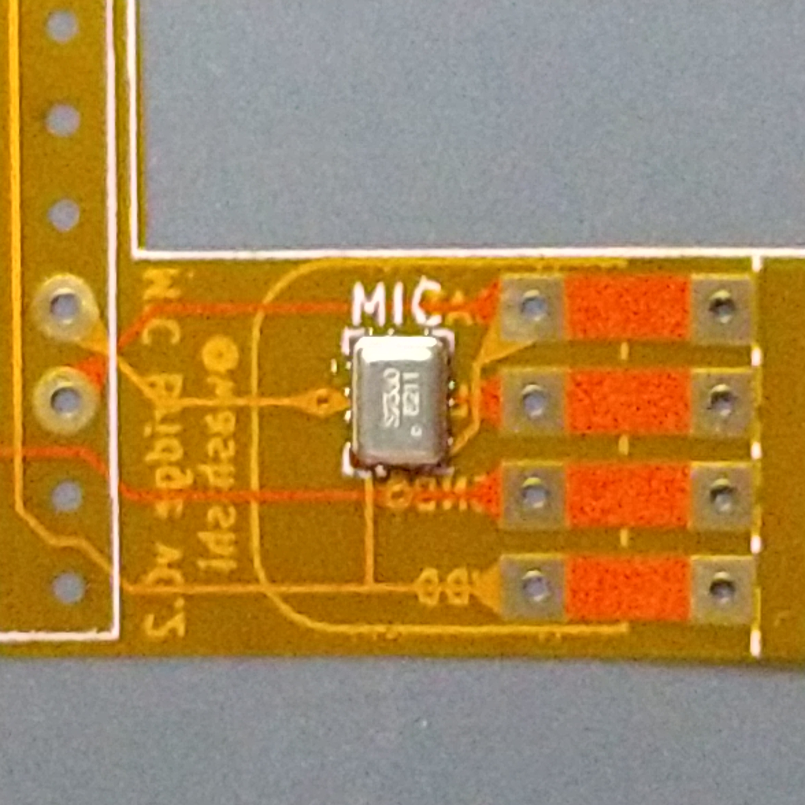

# Core2-Ext. bridge & MIC bridge

 
 
 
 
 

 
 
 
 
 

## 概要
主にRT版ｽﾀｯｸﾁｬﾝにおいて利用できる下記基板(フレキシブル基板)のKiCad7.0で作成したデータです  
(すぐに[JLCPCB](https://jlcpcb.com/JPV)へ製造を依頼できるGarberFile [Core2_Ext._bridge.zip](./production/Core2_Ext._bridge_2023-09-26_04-28-21/Core2_Ext._bridge.zip) もあります)

* Core2-Ext. brige
  * [M5Core2](https://docs.m5stack.com/ja/core/core2) の CORE2 Expansion board を接続してマイクとIMUが使える様にします(はんだ付け不要)  
  * CORE2専用です (BASIC系では取り付けたCORE2 Expansion boardが物理的に干渉するため利用できません)  
  * ｽﾀｯｸﾁｬﾝ基板以外でも物理的に干渉しなければ使えると思います
  
* MIC brige
  * CORE S3以外のM5Stackを利用する場合にPDMマイクを内蔵で追加します
  * ｽﾀｯｸﾁｬﾝ基板以外でも物理的に干渉しなければ使えると思います
  * マイクの接続先のGPIOはCORE2(for AWSも含む)と同じで下記になります  
  　MIC CLK：GPIO0  
  　MIC DAT：GPIO34  
    ※BASIC系で利用する場合はPORT-AにPDMマイクユニットを接続する場合とはGPIOが異なりますのでソースを変更してリコンパイルをする必要があります

  * 利用できることを確認しているマイクは[秋月電子](https://akizukidenshi.com/catalog/)で扱っている下記のどちらかになります  
  (店舗在庫はあまりたくさん置いてないことがあるので通販で購入するか行く場合は事前にWebで在庫数確認したほうがいいかも)
    * SPH0641LU4H使用 超広帯域マイクモジュールキット  
      通販コード：K-15577  
      (クランプで挟みはんだ付け不要で取り付け または はんだ付けにより取り付け)  
    * 超小型シリコンマイクロホン 超音波対応 SPH0641LU4H-1-8  
      通販コード：P-14730    
      (マイクチップ単体、リフローによるはんだ付けが必要)  
      ※その他[Knowles社のサイズ、端子が同じデジタルPMD出力のマイク](https://www.knowles.com/subdepartment/dpt-microphones/subdpt-sisonic-surface-mount-mems)はおそらく使えるのではないかと思われます

## 注意事項等(重要)
 * 無保証です、自己責任で利用願います  
  本データおよび本データから作成したフレキシブル基板の利用上等に発生したいかなる問題についても私の方では補償いたしません
 * 取り付けてそのままでも問題ないことを確認していますがショート等が気になる場合は各自テープを貼ったりして絶縁してください  
 * 一度取り付けたフレキシブル基板は取り外すとスルーホールが広がってしまう為 
   再度取り付けても接触不良が発生して利用できない場合が多いです (シール等と同じと考えてください)  
   また 初回取り付けでも個体差等により接触不良を起こす場合があるかもしれません

## ライセンス
   このリポジトリ配下のファイルは[Apache version 2.0ライセンス](./LICENSE)で配布いたします  
   改変、頒布等 は自由にしていただいて構いません

 

## JLCPCBへの製造の依頼について
費用は円のレートにより変動しますが最低の送料込みで概ね2,500円弱で5枚のフレキシブル基板が作れます

※下記に簡単に手順を書きますが 画像付きで説明されているサイト等もあるので各自検索してみてくださいｗ
* ユーザ登録、配送先の登録について
   * まずユーザ登録が必要です、まだの場合は[JLCPCBのWeb](https://jlcpcb.com/JPV)を開き右上の「登録」よりユーザ登録を行います  
    登録方法についてはユーザ名、メールアドレス、パスワード(確認を含め2回)の入力し「I'm not a robot」のチェックボックスをつけて「Sign Up」をクリックするか 「Sign in with google」をクリックしてGoogleアカウント連携を行います  
   * JLCPCBより登録確認のメールが指定したメールアドレスまたはgoogleアカウントのgmailに届くので  
   メールにある「Verify email address」のリンクを開くと登録完了となります
   * 再度[JLCPCBのWeb](https://jlcpcb.com/JPV)を開き右上の今度は「ログイン」を選び必要事項を入力して「Sign In」をクリックするか  
   Sign in with google」をクリックして連携したGoogleアカウントでログインします
   * ログインしたら右上に自分のユーザ名が出ているのでクリックします
   * 右上の「Ship to」」をクリックして「Country/Region」(国:Japan) と「Currency」(通貨:JPY￥)を設定します  
   * 左側の一覧より「Account Setting」をクリックしますその後「Address Book」の項目の右のほうにある「Edit」をクリックします  
   すると「Address Book」が開くので、「+ Add a new shipping address」をクリックして送付先の氏名や住所等を入力して「SAVE」をクリックして保存します   

      以上でユーザ登録及び配送先の登録は完了です
* JLCPCBへの製造の依頼方法
   * まずGarberFile [Core2_Ext._bridge.zip](./production/Core2_Ext._bridge_2023-09-26_04-28-21/Core2_Ext._bridge.zip) をダウンロードして任意の場所に保存します
   *  [JLCPCBのWeb](https://jlcpcb.com/JPV)を開きログインします
   * ログインしたら右上に自分のユーザ名をクリックし、その後「Order now」をクリックします
   * するとオーダーの詳細画面になるので一番上の選択が「Standard PCB/PCBA」になっていることを確認します
   * 「Add gerber file」をクリックして先ほどダウンロードしたGarberFile  [Core2_Ext._bridge.zip](./production/Core2_Ext._bridge_2023-09-26_04-28-21/Core2_Ext._bridge.zip) を選びアップロードします(すると基板の図が表示されます)
   * 詳細より下記を変更等します　 変更内容によっては右側の「Calculated Price」(製造費用)が変動します
        * Base Material ： 「**Flex**」 (フレキシブル基板) を選択
        * PCB Qty ： 製造する数量です デフォルトは5枚ですが5枚を選ぶと6枚届くことが多いです (製造の際に四角にならないと面倒な為？)
        * 今回のデータは1枚で Core2-Ext. brigeを2枚、MIC Bridgeを1枚含んだ基板のデータとなっています(個々の切断は行わないので「Different Design」や「Delivery Format」はデフォルトで構いません 出来上がり後各自カッターやはさみで切断してください)
        * Remove Order Number ： 「**Specific location**」 製造時に基板に追加されるオーダー番号をあらかじめキーワードで指定した位置(未使用部分の一部を指定)にします

     その他はデフォルトで問題ありません　(色とかは好みで変更してもかまいませんが追加費用が発生します)  
      問題がなければ右側の「SAVE TO CART」をクリックしてカートに登録します
   * カートに登録したら右上のカートのアイコンをクリックして開きます  
   * カートの内容が表示されるので問題なければ右側の「Secure Checkout」をクリックして進みます
    * 「1.Shipping Address」で「Shipping Information」(配送先)と「Billing Information」(請求情報のメールの送付先)確認が出るので問題なければ 「Continue」で進みます
    * 「2.Shipping Method」(配送方法の選択)になります、しっかりした梱包で発送されるので特に急がないのであれば一番安い「OCS NEP」でいいと思います (選択により右の「Shipping」(送料)及び「Grand Total」(総合計価格)が変わります)
  　選択したら「Continue」で次に進みます
    * 「3.Submit Order」支払タイミングの選択です デフォルトの「Pay Directly(recommended)」(即時)でいいと思います、「Continue」で次に進みます
    * 「4.Payment」 支払方法の選択です　PayPal または クレジットカードが選べるので好きなほうを選びます (PayPalを利用する場合は[PayPalの登録](https://www.paypal.com/jp/webapps/mpp/account-selection)が必要です)  
    またここで利用可能なクーポンがある場合はクーポンの選択が出ますので利用する場合は選びます(新規登録した場合は総額54$の各種クーポンが貰えてるはずです、クーポンは利用期限がありまた3Dプリントのクーポンもあると思うので別途ｽﾀｯｸﾁｬﾝの外装等を注文してみてもいいかも)  
    問題なければ 「Pay」をクリックして発注を確定します 支払いでPayPalを選んだ場合はPayPalの画面が別に開くのでそこで確認すると発注確定となります  
    後は待てばそのうち製造されたフレキシブル基板が届きます。(製造、発送の状況は「Order History」から確認できます)  
    配送方法が「OCS NEP」の場合は日本に着いてからはヤマト運輸でサイズが小さいためネコポスでポストに配達されることが多い様です

## 組立/取り付け方法等
* Core2-Ext. brige
  * CORE2(無印)付属のCORE2 Expansion boardを取り付けるものです (※CORE2 Expansion boardのみの別売りはありません)   
  * CORE2 Expansion board に Core2-Ext. brige を写真の向きで合わせて定規等でできるだけ水平状態のまま奥まで押し込みます  
    (この写真ではCore2-Ext. brigeの向きはCORE2 Expansion boardの文字の向きに合わせていますが　Core2-Ext. brigeのパターン的には逆さにしても裏返しても問題ないように作ってあります)
    
 
      
    
    

   * 繋げたものをさらにｽﾀｯｸﾁｬﾝ基板のピンヘッダに合わせて同様に定規等で奥まで押し込みます(ケースに基板が付いた状態で押し込みにくい場合はピンヘッダに合わせて置いてそのままずれないように注意しながらCORE2を上からはめてしまってもかまいません)  
   * 後は通常通りCORE2を取り付ければCORE2 Expansion boardのマイク/IMUが利用できるはずです (CORE2のファクトリーデモ等で確認してみてください)  
    
 
      
    

   

* MIC brige  
  * BASIC系やCORE2を利用する際に追加でPDMマイクを取り付けるものです
  * はんだ付けなしで利用する場合
    * MIC brige以外に必要な物  
      * [秋月電子](https://akizukidenshi.com/catalog/)で扱っている
        SPH0641LU4H使用 超広帯域マイクモジュールキット  
        通販コード：K-15577  
      * タミヤの 楽しい工作シリーズ（クラフト）No.202 (Item No:70202)  
        [プラ材3mmコの字形棒（5本入）](https://www.tamiya.com/japan/products/70202/index.html)  
        ※透明のもありますが材質的に白のほうが加工しやすい様です   
        10mmで切断してフレキを基板に挟むクランプとして使います  
        (少量しか使わないので３Dプリンタで作成したり他の代用品を探してみてもいいかも)  
        
 
         
        

        
    * 取り付け  
      * MIC brigeとマイクモジュールの端子を接触するように合わせマイクモジュールを巻き込むようにしてマイクモジュール付属の細ピンヘッダを穴に刺して仮止めします(穴が小さめなので少し力をかけて押し込んでください)  
        
 
        
        

      * コの字形プラ棒のクランプを差し込みます   
        
 
        
        

      * 仮止めのピンヘッダを取り外しクランプを奥まで押し込みます 
        
 
        
        

      * 後はｽﾀｯｸﾁｬﾝ基板のピンヘッダに合わせて定規等でできるだけ水平状態のまま押し込めば完成です(押し込みにくい場合はピンヘッダに合わせてフレキを置いて、ずれないように注意しながらそのままM5Coreを取り付けてください)  
        
 
        
        

      * 完成  
        
 
        
        

  * はんだ付けして利用する場合  
    * MIC brige以外に必要な物は下記です  
      * [秋月電子](https://akizukidenshi.com/catalog/)で扱っている
        SPH0641LU4H使用 超広帯域マイクモジュールキット  
        通販コード：K-15577  
      * はんだごて、はんだ、ニッパー、ラジオペンチ(ピンヘッダを利用する場合) 等
     * マイクユニット付属のピンヘッダを利用する場合　
       * まずマイクユニットのマイクの穴の方にピンが出る状態でピンヘッダをはんだ付けします(通常利用する場合と逆にピンが出る状態)
       * その後ピンヘッダの黒い樹脂をラジオペンチ等で引き抜きます(そのまま利用するとBASIC系では背が高くなり干渉するので黒い樹脂を外してフレキとモジュールを密着させます) 
       * ピンヘッダのピンのついたマイクモジュールをフレキに刺してモジュールの基板とフレキが密着した状態ではんだだ付けします(ピンヘッダを刺す穴が小さめなので少し力をかけて押し込んでください)      
        * はんだ付け後ピンヘッダの飛び出した部分はニッパーでカットしてください
     * マイクユニット付属のピンヘッダを利用しない場合　
       * マイクユニットとフレキのランドに薄く予備はんだします
       * マイクユニットをフレキに合わせ角からはんだごてを当ててはんだを追加し両方のはんだを溶かして接続します  
       * あとははんだ付けしない場合と同様に取り付けます  
        
 
         
         
           
        
  
         ※上の写真では余白に書いたｽﾀｯｸﾁｬﾝの絵の部分を切り取らずにそのまま残してます  

  * マイクチップをリフローして取り付ける方法  
   ※以下の写真のフレキは旧バージョンでマイクの向き、パターン等が異なりますが制作方法は同様です
    * MIC brige以外に必要な物  
      * [秋月電子](https://akizukidenshi.com/catalog/)で扱っている
         超小型シリコンマイクロホン 超音波対応 SPH0641LU4H-1-8  
        通販コード：P-14730  
      * ヒートテーブル、クリームはんだ、ピンセット等  
        
 
        
    * リフロー手順  
      * ごく少量クリームはんだをマイクチップのランドに塗ります    
       ※写真の量だとクリームはんだが多すぎた様です   
        
 
         
        

      * ピンセットでマイクチップを載せます  
        その後ヒートテーブルで加熱してリフローします  
        (私の方では融点138℃の低温クリームはんだを使ったので150℃で10秒ほど加熱しました)
        
 
         
        

      * リフロー後多すぎたクリームはんだがはんだボールになってしまいました・・・  
        ピンセットの先等で擦って取れる範囲で取り除きます   
        
 
         
        

      * はんだボール除去後   
        
 
         
        

      * 後はｽﾀｯｸﾁｬﾝ基板のピンヘッダに刺して完成です  
        フレキの左側は不要なので切ってしまってもかまいません (今回配布するデータはマイクの端で切ってしまっても問題ない様にパターンが作ってあります)    
        
 
          
        

           
           
## スルーホールでピンヘッダに接続する仕組みについて
  ピンヘッダのピンは1辺0.8mmの角型になっています、その為対角では約0.83mmとなるので  
  0.8mmのスルーホールに刺すことにより4つの角がスルーホールを広げて接触します  
  ただし一度取り外すと穴が広がって接触不良となりやすいので再利用は難しいです
